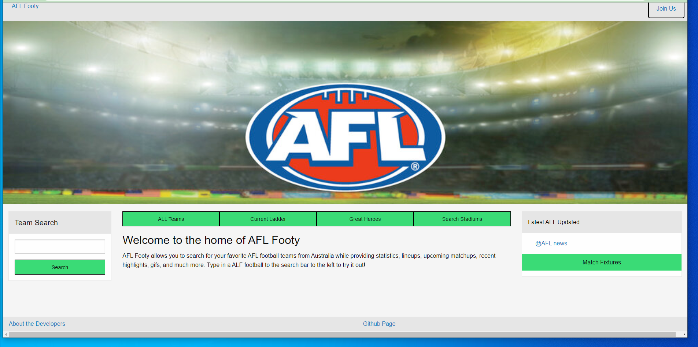

# AFL-team-data
AFL-team-data is an interactive website which help users to see all AFL teams playing in 2022. It also shows current ladder for 2022. It also incoaparates latest news regarding AFL. And users can click on Great Heros tab it directs to the legends of the game. Users can also search for stadiums by cicking search stadiums icon.

## Project live site 
https://sudheer313.github.io/afl-team-data2/

## UX
This website is developed for AFL followers and also for people to know about this game.It is a very popular sport in Australia. There are very limited and restricted source of information on Australian footbal. And so we took up this project to provide necessary information and familiarize people about this sport,especially who are new to this country.

### UserStories

1.As a user I would like to ALL Team playing in AFL for year 2022.

2.As a user I would like to see Current ladder for playing teams in 2022.

3.As a user I would be intrested to see current heroes of the game.

4.As a user I would to interested in seraching for stadiums.

5.As auser I would be interested to see latest AFL news

## Technologies Used
Foundation CSS

JavaScript    

CSS

HTML 

# Mock-up

My demo screen shots

#Features
## Current features
1. AllTeams: when a user clicks on ALL Teams icon it would display the data for AFL teams playing for current season.
2. Current ladder: when a user clicks on current ladeer it would display data for current ladder for playing teams 2022.
3. Great heores: when a user clicks on current user it would display the legends of the game.
4. Search Stadiums: when a user clicks on search stadiums it would let the user to search for venues.

## Features for further enhancement
1. We would like to show all the stadiums where AFL mathes are played in AUstralia in Google Maps.
2. We would also like incooperate Weather app when a user can check for weather conditions for a given place and day.

#Deployment
* Deployed in git hub through my Github Account
## Git hub repo
sudheer313/afl-team-data2

## Link to github repo
https://github.com/sudheer313/afl-team-data2
## Link to live site
https://sudheer313.github.io/afl-team-data2/

## Credits
1. [MDN files] https://developer.mozilla.org/en-US/docs/Web/API
2. [swiggle API ] https://api.squiggle.com.au/
3. [Google search]https://www.google.com/
4. [google maps API] https://developers.google.com/maps/documentation/javascript/get-api-key
5. [AFL website ] https://www.afl.com.au/

## Media
1. AFL 2022 season logo obtained from Google images by search of the same name.
2. AFL team logos obtained from AFL website.
[AFL website ] https://www.afl.com.au/

## What we learned
I learned many important fundementals of javascript creating this project.  I used a combination of APIs to fetch data and also display data in UI. The most important things we learned was time management and team work to acheive tasks collectively and collaborate with each other.

## Challenges 
There were a few challenges we ran into devoloping this website. We had a hard time figuring out which APIs to use. Once APIs were finalised we had a bit of trouble fetching information. Once information is fetched we had trouble with diplaying across. Most importantly with google maps API, we had trouble with displaying it. But finally we managed it by following google documentation and generating API.

## Team
* Ravi Velaga
* Anurag Saini
* Sudheer Kandula

## Acknowledements
* We would like to thank our mentor Mr.ALI Raza and TA Mr.Kunal Choudary for guiding us through the project and giving necessary inputs. We would also like to thank our team for acheiving the required milestones.
